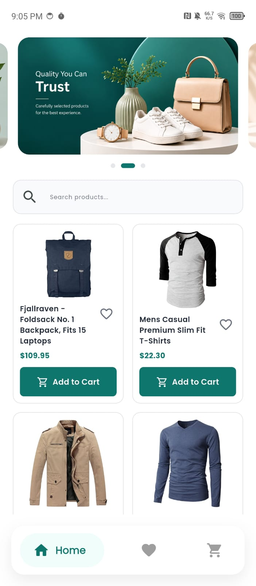
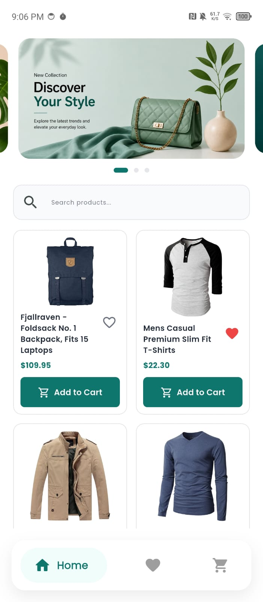
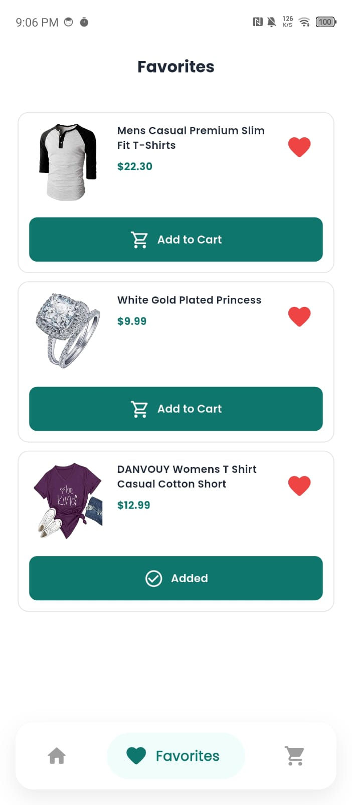
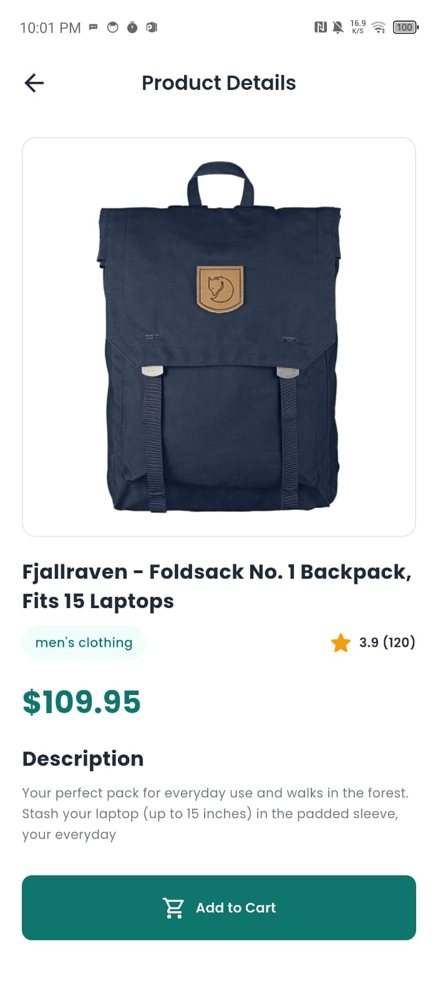
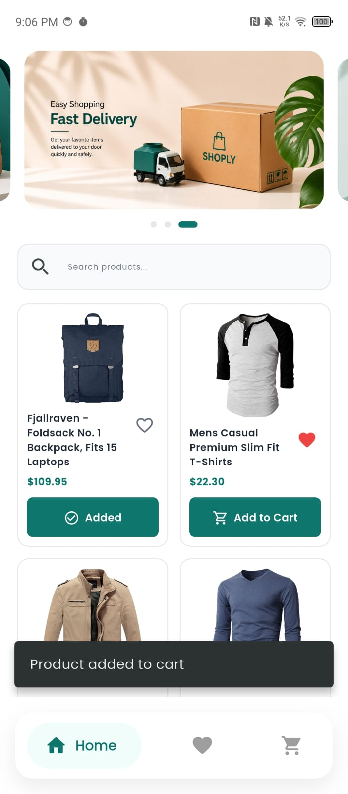
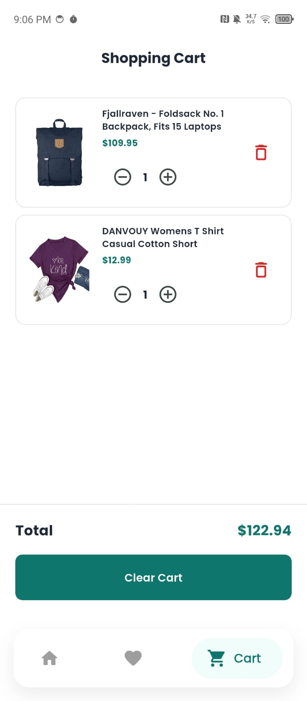
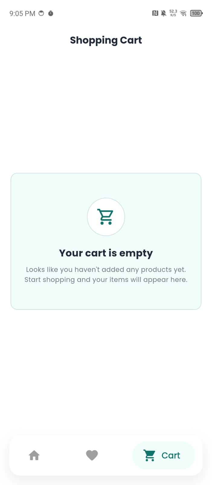
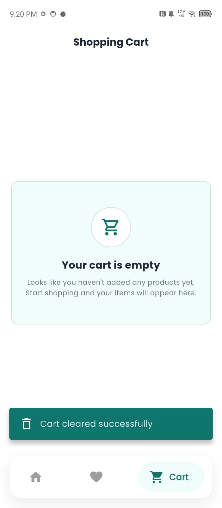

# Shoply

Flutter technical task for a product catalog and shopping cart application.

## Features

- Display products
- Search products
- Product details
- Add and remove favorites
- Save favorites using SharedPreferences
- Add products to cart
- Increase and decrease quantity
- Remove products from cart
- Clear cart
- Calculate total price
- Save cart data using SQLite
- Responsive UI

## Technologies Used

- Flutter
- Dart
- Provider
- SQLite (sqflite)
- SharedPreferences
- REST API

## Screenshots

### Splash & Home

| Splash | Home |
| ------ | ---- |
|  |  |

### Favorites

| Add to Favorites | Favorites |
| ---------------- | --------- |
|  |  |

### Empty Favorites & Product Details

| Empty Favorites | Product Details |
| ---------------- | --------------- |
|  |  |

### Cart

| Add to Cart | Cart |
| ----------- | ---- |
|  |  |

### Empty Cart & Clear Cart

| Empty Cart | Clear Cart |
| ---------- | ---------- |
|  |  |